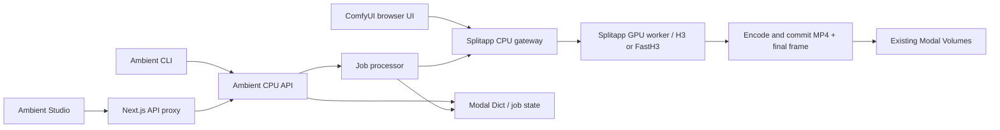

# H3 / FastH3 Ambient backend and CLI

This repository provides the Modal backend for [Ambient Studio](https://github.com/hndrr/ambient-studio). The standalone frontend owns playback, FX, MIDI controls and the Next.js `/api/ambient` proxy. The former `comfy-stream` Ambient screen and proxy have been removed.

Use `splitapp.py` together with `ambient_app.py`. Splitapp serves the ComfyUI UI and API on CPU and dispatches H3 or FastH3 to its GPU worker only for generation. Ambient provides the CPU job API and clip processing. Both modes use ComfyUI through Splitapp. Both apps reuse the existing authentication and model/input/output Volumes. Deploying or opening the frontend does not download models.

**Current configuration (2026-09-16):** The abandoned FastVideo worker (`FastH3.*`), its GPU image and `prepare_fasth3` snapshot downloader have been removed. Its separate snapshot was already deleted. ComfyUI FastH3 and its INT8 model/VAE remain available through Splitapp.

Both H3 and FastH3 use `MiniMaxH3FastVAEDecode` with `tile_batch_size=4` for video decoding, from [Mozer/ComfyUI-MiniMax-H3-MotionCache-FastVAE](https://github.com/Mozer/ComfyUI-MiniMax-H3-MotionCache-FastVAE) at `b719329e0ecf35f0ae08d241c363ed1e56adbb95`. Audio still uses `VAEDecodeAudio`; MotionCache is not connected. The node is included in new Split environment templates. Existing environments need the same extension installed through the normal custom-node update process and validated before deploying the new Ambient recipe. `check_comfy` and generation reject a missing decoder before submitting a GPU job. Fast VAE depends on H3 VAE internals as well as its public node schema; recheck it when updating ComfyUI. The measurements below predate this decoder change.

**Fast VAE validation (2026-09-16):** After installing the node in the active Split environment and redeploying Ambient, both preview modes produced 124-frame audio/video clips on RTX PRO 6000. ComfyUI execution took 39.27 seconds for FastH3 (VSA) and 42.59 seconds for H3. H3's decoder logged 5.34 seconds. These single runs include loading differences and do not isolate a decoder speedup. Records and output clips are under `ambient/docs/validation/2026-09-16/fastvae/`.

**GPU validation (2026-09-15):** H3 produced native audio/video at both resolutions on one RTX PRO 6000, including three parent-linked preview clips. FastH3 through ComfyUI produced audio/video at both resolutions with the requested INT8 model/VAE and the native VSA sparse producer path. Local tests also cover job lifecycle, retention and failure handling.

## Measured ComfyUI runs (2026-09-15)

The following runs used one RTX PRO 6000 Blackwell Server Edition, ComfyUI 0.34.0, comfy-kitchen 0.2.33, PyTorch 2.10.0+cu130 and CUDA 13.0 in the active Split environment. Each video has 124 frames at 24 fps, with H.264 video and AAC stereo audio. Both FastH3 resolutions used the native VSA sparse producer path and the requested INT8 video VAE; representative frames were visually checked for black output.

| Route / input | Resolution | Native execution | GPU worker including startup | CLI through local save | Observed VRAM / container RAM |
| --- | --- | ---: | ---: | ---: | ---: |
| H3 / text, first clip | 832×480 | 40.0 s | 63.3 s | unavailable | unavailable |
| H3 / previous final frame, clip 2 | 832×480 | 55.8 s | 94.4 s | 401.6 s | 40.7 / 90.2 GiB |
| H3 / previous final frame, clip 3 | 832×480 | 52.8 s | 75.9 s | 113.3 s | 40.8 / 90.2 GiB |
| H3 / text | 1344×768 | 75.8 s | 96.2 s | 184.8 s | 39.9 / 89.7 GiB |
| FastH3 / text | 832×480 | 47.3 s | 74.4 s | 125.7 s | 39.0 / 86.4 GiB |
| FastH3 / text | 1344×768 | 51.4 s | 69.9 s | 387.6 s | 40.2 / 87.5 GiB |

Native execution is ComfyUI history start-to-success, including node-level loading and media processing. The CLI duration includes allocation waits, startup, processing, polling and download. For example, the FastH3 quality run spent 290.4 seconds between Split queue acceptance and the worker start marker. These single runs are not an engine speed benchmark. Memory is the maximum observed at roughly two-second intervals; container RAM includes file cache. H3 clips 2 and 3 shared a GPU container but restarted the ComfyUI process, so this is not fully warm model reuse. The first run exposed a polling-timeout handling bug; its existing result was recovered without resubmission, leaving CLI duration and peak memory unmeasured.

H3's three parent-linked clips preserved the boundary image. After the ComfyUI runs, the GPU reached zero containers while the Split CPU control connection remained open. Local measurement records, native logs, request bodies, MP4s and the detailed report are saved under the ignored `ambient/docs/validation/2026-09-15/` directory. Cached `ready` records still describe provisioning only. FastVideo validation was cancelled before GPU allocation at the user’s request. After stopping the CLI monitors and control connection, both deployed apps reached zero CPU/GPU containers and all temporary validation apps were stopped.

## Responsibilities and data flow



| File | Responsibility |
| --- | --- |
| `ambient_app.py` | Modal images, resource settings, remote function declarations and dependency wiring |
| `ambient/api.py` | HTTP validation, multipart parsing, status codes and response lifetimes |
| `ambient/service.py` | Job acceptance, deduplication, status reconciliation and cancellation |
| `ambient/job_state.py` | Read job state and atomically claim one terminal result shared by cancellation and completion |
| `ambient/processing.py` | Generate, finalize, commit and publish a job; storage and generators are injected for local tests |
| `ambient/storage.py` | Ambient file paths, image normalization, parent-frame loading and Volume access |
| `ambient/comfy.py` | ComfyUI HTTP/WebSocket control through splitapp, job-scoped cancellation and result download |
| `ambient/split.py` | Verify that the configured endpoint is the split CPU gateway in split mode |
| `ambient/h3.py` | Native H3 and FastH3 recipes bound to the running server’s node definitions |
| `ambient/models.py` | Pinned model manifests, checksums and source references |
| `ambient/client.py`, `ambient/cli.py` | Shared HTTP client and browser-free job commands |
| `ambient/media.py` | Audio-required MP4 encoding, metadata inspection and final-frame extraction |
| `ambient/readiness.py` | Saved capability records and the explicit ComfyUI inventory check |
| `ambient/urls.py` | Backend URL validation and redirect protection for proxy credentials |
| `ambient/maintenance.py` | Retention of terminal jobs and Ambient-owned files |

The processor claims `completed` only after storage has committed both Volumes and cancellation has been checked again. Completion, cancellation and failure share a single `terminal:<job_id>` record in the existing job Dict, written with `put(skip_if_exists=True)`. The first terminal claim wins; its state and clip metadata are saved together, so later progress or completion writes cannot change an accepted cancellation, and a late cancellation cannot hide an already-completed clip. Existing job records and legacy cancellation markers remain readable. HTTP capability reads use saved records only. Ambient has no GPU image or GPU function; local processing and storage tests do not need GPU dependencies.

In **split mode**, keeping the ComfyUI browser tab open keeps only the CPU UI active. H3 and FastH3 generation from either that UI or Ambient share the splitapp job queue and GPU worker. After the queue finishes, the GPU can scale to zero even while the UI remains open; CPU and storage usage can continue. Splitapp currently uses `min_containers=0` and a 30-second idle scale-down window. Explicit legacy mode keeps a GPU session active, so both Ambient ComfyUI routes reject that mode. See [the split deployment guide](comfyui-split.md) for its other explicit GPU operations, such as environment validation.

## Configuration

Use the repository's `.env` and pinned `.modal-profile`. Do not put credentials in `NEXT_PUBLIC_*` variables.

```dotenv
AMBIENT_COMFYUI_URL=https://YOUR-WORKSPACE--comfyui-split-ui.modal.run
MODAL_PROXY_KEY=...
MODAL_PROXY_SECRET=...
```

Use the actual `ui` URL printed when deploying `splitapp.py`. The standard `comfyapp.py` endpoint is not the H3 backend for this configuration, and deploying it is unnecessary. `ambient_app.py` still imports `comfyapp.py` for shared configuration and Volume definitions; importing it does not deploy that app.

The frontend's `.env.local` needs `AMBIENT_BACKEND_URL` pointing to the **Ambient API**, plus `MODAL_PROXY_KEY`/`MODAL_PROXY_SECRET`. It accesses ComfyUI only through this job API. Neither asset-management UI nor a browser ComfyUI connection is required.

Configured backend URLs must use HTTPS and a valid host, without embedded credentials, query strings or fragments. Requests reject redirects so custom Modal auth headers cannot be forwarded to another endpoint. The H3 adapter and inventory check permit HTTP to localhost/loopback only for credential-free local tests.

Ambient reuses the function timeout from `comfyapp.py`. GPU resources and lifecycle are configured in Splitapp; Ambient itself runs on CPU only.

### Ambient用ComfyUIの追加ノード

`ambient_app.py` の接続先である `splitapp.py` に、次のprivateリポジトリを追加します。

- [ComfyUI-AgentRuntime](https://github.com/hndrr/ComfyUI-AgentRuntime)
- [ComfyUI-Skills-Loader](https://github.com/hndrr/ComfyUI-Skills-Loader)
- [ComfyUI-GeminiTools](https://github.com/hndrr/ComfyUI-GeminiTools)
- [ComfyUI-Jev](https://github.com/hndrr/ComfyUI-Jev)

ModalにSecret `github-secret` を作り、`GITHUB_TOKEN` に4リポジトリの
Contentsを読み取れるGitHubトークンを登録してください。別名のSecretを使う場合は
`GITHUB_SECRET_NAME` で指定します。トークンはCPUの取得処理へ渡し、
ComfyUI子プロセス・GPU・Git remote URL・イメージには保存しません。

`.env` の `COMFYUI_AMBIENT_MODE=on` を設定してからデプロイします。一度だけ指定する場合は次の形です。

```sh
COMFYUI_AMBIENT_MODE=on ./scripts/modal.sh deploy splitapp.py
./scripts/modal.sh deploy ambient_app.py
```

CPUゲートウェイの起動時に、4リポジトリのデフォルトブランチの最新HEADを取得します。
ビルド時の固定SHAではなく、再起動やスケールゼロからの復帰でも更新を確認します。
実行中のcheckoutへ直接pullせず、全件を一時ディレクトリへcloneした後、変更がある場合だけ
既存環境を複製して4つを入れ替えます。requirementsをまとめてインストールし、既存の
CUDA等の依存制約とCPUでの4パッケージの読み込みを確認してからVolumeへ保存・反映します。
GPUはジョブに記録された同じ環境を使い、独立したpullや更新確認のための起動は行いません。

最新SHAが同じなら環境の複製や依存の再インストールは省略します。取得・依存・importの失敗時は
旧環境を維持し、CPUログに理由を出します。初回導入が失敗した場合は追加ノードなしで起動します。
未完了ジョブ、Managerの編集中環境、従来モードのセッションが残る起動では、次のアイドル起動まで
更新を延期します。CPU検査はノードのimport検査であり、外部API・CLI実行やGPU推論の成功確認ではありません。

追加分は各環境の `ambient_nodes/` に保存し、モードがonの場合だけComfyUIの検索パスへ追加します。
通常の `comfyapp.py` と、モードoffのsplitappでは取得も読み込みも行いません。
無効化は `COMFYUI_AMBIENT_MODE=off` でsplitappを再デプロイします。
同名パッケージが既存の `custom_nodes/` に手動導入されている場合は、自動置換せず更新を止めて
重複をログに表示します。Managerでの他ノードの更新時も4つのスナップショットを引き継ぎます。

追加ノードのAPIキーとBridgeの接続トークンも、Modalに保存したSecretから読み込みます。
使うサービスのSecretを作成し、デプロイ元の環境変数または `.env` にはSecret名だけを指定してください。

| `.env` の設定例 | Modal Secret内のキー |
| --- | --- |
| `GEMINI_SECRET_NAME=gemini-secret` | `GEMINI_API_KEY` |
| `TYPESAFE_SECRET_NAME=typesafe-secret` | `TYPESAFE_API_KEY` |
| `OPENROUTER_SECRET_NAME=openrouter-secret` | `OPENROUTER_API_KEY` |
| `AGENT_RUNTIME_SECRET_NAME=agent-runtime-secret` | `AGENT_RUNTIME_BRIDGE_TOKEN` |

Secret名は既存のものを指定でき、空欄のサービスは使いません。
指定したSecretと必要なキーの存在はデプロイ時にModalが検査します。
AmbientモードのCPU/GPUへ同じSecretを渡し、コンテナ起動時にキーを環境変数へ注入します。
ローカルのAPIキーや `AGENT_RUNTIME_BRIDGE_TOKEN` の値はデプロイ設定に取り込みません。

Bridgeの接続トークンは、自分で生成するランダムな共有文字列です。たとえば手元で
`openssl rand -hex 32` を実行し、その値をModal Secretの `AGENT_RUNTIME_BRIDGE_TOKEN` に保存します。
`.env` に `AGENT_RUNTIME_SECRET_NAME=agent-runtime-secret` を設定してsplitappを再デプロイすると、
ComfyUIプロセスに注入されます。MacのNode.js backendにも同じ値を設定し、
`createAgentRuntimeBridge` の `bridgeToken` に渡します。上流サンプルではMac側の環境変数名は
`COMFY_BRIDGE_TOKEN` です。Reactの公開環境変数やワークフローJSONには入れません。

[上流Bridge](https://github.com/hndrr/ComfyUI-AgentRuntime/tree/main/packages/agent-runtime-bridge)
のMac backendは、splitappのCPU `ui` URLへ接続します。Modalのproxy認証も必要なので、
`createAgentRuntimeBridge` の設定へ次を追加してください。これらもMac backendの環境変数です。

```ts
headers: {
  "Modal-Key": process.env.MODAL_PROXY_KEY!,
  "Modal-Secret": process.env.MODAL_PROXY_SECRET!,
},
```

分離モードでは、CPUがMacの接続とモデル・Skill一覧を保持します。Bridgeノードを含む
ワークフローを実行すると、GPUのBridgeへ接続を中継し、接続完了後に生成を開始します。
入力ファイル・生成画像・実行結果もそのGPUジョブへ転送します。Bridgeへの接続や一覧の
取得だけではGPUを起動しません。GPUの終了後もMacとの接続は保持します。

Macの切断・GPUの終了・キャンセル時には進行中のBridge処理も終了し、失敗した処理を
自動再実行しません。待機中にMacが再接続された場合も、元の接続に紐づくジョブは失敗にします。
旧モードへ切り替える際はMacのBridgeを切断してください。環境更新中の新規接続は拒否します。
Mac側へのBridgeパッケージの組み込みとCodexログインは別途必要です。

Skills Loaderのアップロード先 `input/skills/` は既存の入力Volumeへ保存され、GPUからも参照できます。
手元のPCのSkillやCLIのログイン情報は自動転送しません。

AgentRuntimeのCLIプロバイダーを使う場合は、Modal側にも対応CLIの導入と認証が必要です。
今回の自動取得はカスタムノード本体とPython依存が対象です。
4つのノードはComfyUIのワークフローから利用でき、Ambient Studioの画面やH3生成レシピに
自動で組み込まれるわけではありません。

## Explicit provisioning (incurs cloud usage; not automatic)

When ready to use Modal again:

1. Prepare missing H3 files using the existing model saver:
   `./scripts/modal.sh run scripts/prepare_ambient_h3.py`.
   This uses `Comfy-Org/MiniMax-H3` at `a98869194787969724c7425d95d0ed73ce9202af` and its original model directories.
2. Deploy the split UI and GPU worker:
   `./scripts/modal.sh deploy splitapp.py`.
   Set `AMBIENT_COMFYUI_URL` to its CPU `ui` endpoint and keep it in split mode. Deploy the gateway from this branch to include the mode guard used by Ambient.
3. Deploy the API/processor:
   `./scripts/modal.sh deploy ambient_app.py`.
4. Check the split CPU gateway's native node/model inventory:
   `./scripts/modal.sh run ambient_app.py::check_h3`.
   This can wake the split CPU UI, but does not invoke its GPU worker. It first checks `/modal-control/v1/status` and rejects legacy mode, environment transitions and unresolved jobs. Capabilities report the inventory result and separate `gpuValidated: false` status. API capability reads themselves use Dict only. Old preparation records for the standard ComfyUI endpoint must be replaced by this check.
5. Run the explicit smoke script for native audio and three parent-linked clips:
   `python scripts/ambient_smoke.py --mode h3 --clips 3`, then `--mode fasth3 --clips 1`.
   Environment: `AMBIENT_BACKEND_URL`, `MODAL_PROXY_KEY`, `MODAL_PROXY_SECRET`. Downloads are saved locally; listen and visually inspect continuity before qualifying these pins.

Stopping the studio cancels its pending job and closes local resources. For either ComfyUI route, Ambient calls splitapp's `/jobs/<prompt_id>/cancel`: a queued job is removed, and a running job receives an interrupt scoped to its worker. Jobs from other UI clients are unaffected. The GPU is not guaranteed to disappear immediately: interruption must finish and idle scale-down must occur; other queued jobs can keep it busy. A processor execution timeout is terminal, not a reason to keep polling. Scale-to-zero remains enabled.

When Ambient's generation deadline or an HTTP request times out after prompt submission, the adapter also sends cancellation to that same job. This request has a separate 10-second timeout. If cancellation cannot be confirmed, the error says so; inspect ComfyUI history before retrying. No cancellation is sent without a known prompt ID.

## Select the model from the CLI

The CLI and backend changes are in this repository. Ambient Studio's UI is unchanged. The supported pairs are `h3/comfyui` and `fasth3/comfyui`; FastH3 is text-to-video-and-audio only. Both modes default to ComfyUI. No automatic GPU-profile change occurs.

Install the normal Python dependencies and export `AMBIENT_BACKEND_URL`, `MODAL_PROXY_KEY`, and `MODAL_PROXY_SECRET`. The URL points to the Ambient API. Reading preparation status, an existing job or a completed clip does not start a generation GPU:

```sh
python -m ambient.cli capabilities
python -m ambient.cli status JOB_UUID
python -m ambient.cli cancel JOB_UUID
python -m ambient.cli download JOB_UUID --output ./ambient-output
```

The following command submits a generation job and incurs configured cloud usage when pointed at a deployed backend. `--backend comfyui` is optional:

```sh
python -m ambient.cli generate --mode fasth3 --backend comfyui \
  --prompt "A quiet sunlit room, still camera" --sound "Soft breeze and distant leaves" \
  --seed 42 --resolution preview --output ./ambient-output
```

Use `--mode h3` for eight-step H3. H3 accepts either `--image ./anchor.png` or `--parent-clip-id JOB_UUID`. Generation defaults to seed 42, preview resolution and a 3600-second wait; use `--timeout` to change the wait.

The CLI prints and saves `JOB_UUID.request.json` **before** posting the job. A timeout or lost response is not permission to generate a fresh ID. Check the original job first. If a resend is needed, use the saved body:

```sh
python -m ambient.cli submit ./ambient-output/JOB_UUID.request.json --output ./ambient-output
```

The server returns the existing job for an identical request, even if preparation status has since changed. A different body or engine with the same ID returns 409. Output files are `JOB_UUID.mp4` and `JOB_UUID.json`; JSON includes mode/backend and the expected source `references`, not proof of which weights were GPU-validated. Interrupted downloads leave the existing completed local file intact. Ctrl+C requests cancellation of this CLI's job and reports the response; GPU exit still depends on interrupt completion and scale-down.

### Prepare FastH3 for ComfyUI

These explicit provisioning commands incur cloud usage. They are not run by the CLI, app startup, tests or capabilities reads:

```sh
./scripts/modal.sh run scripts/prepare_ambient_h3.py --mode fasth3
./scripts/modal.sh run ambient_app.py::check_comfy --mode fasth3
```

Deploy the updated `splitapp.py` and `ambient_app.py` before using the new route. The model saver uses `Kijai/MiniMax-H3-experimental` revision `f4cac997f880e93cf6940af61ee8d58ef31ff7f3` for:

- `/models/diffusion_models/minimax_h3_fastvideo_vsa_datafree_1300step_4step_int8_convrot.safetensors`
- `/models/vae/minimax_h3_video_vae_int8_convrot.safetensors`

Both downloads are SHA-256 checked before replacing shared model files. The Qwen text encoder and FP32 **audio** VAE come from the existing pinned `Comfy-Org/MiniMax-H3` source. The H3 recipe retains its FP16 video VAE and eight-step LoRA. The word `fastvideo` in the diffusion model filename is part of the publisher's name; this file is loaded by ComfyUI and does not require the removed FastVideo runtime.

The FastH3 recipe uses native VSA at 10% keep across all four Euler steps, CFG=1, video/audio shifts 12/3, and the five-point shifted sigma schedule. The native DynamicCombo selection and its nested fields are bound using the running `/object_info`. No ComfyUI execution code is copied or patched.

The INT8 video VAE requires ComfyUI 0.31.0 or later according to its publisher. Splitapp now deploys ComfyUI 0.36.0 (`7a0b5eede3f9721c8faab290689893f36edc6d66`), with `comfy-kitchen==0.2.34` and frontend 1.52.7 verified in the active environment. This revision includes [MiniMax-H3 VAE optimizations (#16187)](https://github.com/Comfy-Org/ComfyUI/pull/16187). CPU startup and an RTX PRO 6000 decode-only comparison passed: standard VAE and Fast VAE (batch 4) took median 1.797 and 1.724 seconds respectively at 832×480 / 124 frames, with identical decoded tensors. Full H3/FastH3 generation was not repeated for this update; the generation measurements above used 0.34.0. The image build checks the upstream kitchen pin after dependency installation; candidate venvs check protected dependencies before activation. The CPU gateway reports the actual interpreter's kitchen version and API presence. FastH3 checks this report during preparation **and before submission**. Existing venvs that shadow the image with an incompatible kitchen version are reported by the CPU gateway and rejected by the FastH3 preflight. Repair them through the split environment workflow; rebuilding the image alone does not prove they changed. These FastH3 checks do not add a global startup block to the CPU UI.

A CPU check does not probe GPU kernel availability. At GPU qualification, record ComfyUI/kitchen/PyTorch/CUDA versions and GPU type, check `comfy_kitchen.sol_attn_is_available(device)`, and inspect native sparse-attention logs. A run that falls back to dense attention is not a validated VSA run.

`check_comfy --mode h3` checks the original route; `check_h3` remains its compatibility entry point. Preparation records compare their saved source references; an updated recipe requires checking again. Capabilities remain cached and must be refreshed after environment changes at the same URL. Old FastVideo preparation records are ignored.

For later GPU smoke tests:

```sh
python scripts/ambient_smoke.py --mode h3 --backend comfyui --clips 3
python scripts/ambient_smoke.py --mode fasth3 --backend comfyui --clips 1
```

## HTTP contract

All deployed routes require Modal Proxy Auth. The Next.js proxy supplies it server-side.

- `GET /capabilities`: modes, resolutions, 124 frames / 24fps, plus `modes[mode].backends.comfyui` readiness/reason/validation. Mode-level readiness describes `defaultBackend: comfyui` for both modes.
- `POST /images`: multipart field `image`, at most 12 MiB and 24 megapixels; returns `{id}`.
- `POST /jobs`: `{requestId,mode,backend?,prompt,sound,seed,resolution,imageId?,parentClipId?}`. The complete JSON body is limited to 128 KiB while streaming, before JSON parsing; larger requests return 413 without dispatching a job. UUID request IDs are atomic claims. Same content returns the existing job; different content with the same ID returns 409. `mode` is `h3` or `fasth3`, resolution `preview` or `quality`. FastH3 rejects all image/parent inputs. Sound is mandatory. `backend` accepts only `comfyui` and defaults to it for both modes. Explicit `fastvideo` requests return 400. Old saved FastVideo jobs retain their original backend identity, including backend-less historical FastH3 jobs; reusing those IDs for ComfyUI returns 409 and never triggers another generation.
- `GET /jobs/:id`: `queued/running/completed/failed/cancelled`, mode/backend, expected source references on new jobs, stage/error, completed clip metadata with actual dimensions/duration/frame count and `hasAudio`.
- `DELETE /jobs/:id`: for queued/running jobs, attempts to claim the terminal result as cancelled. If completion or failure claims it first, the response returns that result instead. A response of `cancelled` is final; later worker writes cannot turn it into completed or failed. Completed, failed and already-cancelled jobs return their current state unchanged; completed clips remain downloadable and usable as parents. The H3 adapter cancels only its own splitapp job; it never sends a global `/interrupt`.
- `GET /clips/:id`: durable H.264/AAC MP4, supports byte ranges. CPU-side Volume SDK materialization; no GPU wake-up.

ComfyUI upload uses `ambient/uploads`, raw output uses `ambient/raw`. Final MP4s are `comfy-outputs/ambient/clips/<id>.mp4`; exact decoded final frames are `comfy-inputs/ambient/frames/<id>.png`. Uploaded anchors are `comfy-inputs/ambient/images/<id>.png`. Both final artifacts commit before `completed` is published. ffmpeg requires an audio stream; missing audio or A/V duration mismatch is a failed job. Finalization removes its `.part.mp4` on success or failure. The 24-hour retention task also removes leftover partial clips from terminated workers, along with Ambient-owned files and job records (including terminal claims), never other ComfyUI assets or models.

A backend control-only WebSocket connects to splitapp's CPU gateway and drains progress without forwarding binary previews to the browser. History is polled for completion, and `/view` reads the output after splitapp reloads the worker's committed Volume. Cancelling an Ambient job from the ComfyUI queue also ends Ambient's wait. If the control connection or worker dies after prompt submission, the job fails with an uncertain-upstream-result message rather than submitting a second GPU prompt. Dispatch crashes are never retried by re-spawning the same ID. HTTP retry uses the original ID.

If a queued job has no saved dispatch acknowledgement after 300 seconds, its status stays `queued` with a `Dispatch unconfirmed` stage. A missing acknowledgement does not establish whether a worker was started. Polling can still observe a delayed completion, and resending the same request never dispatches it again. The CLI's wait deadline still applies; inspect Modal or cancel the existing job if its dispatch remains unconfirmed.

Before each ComfyUI generation, Ambient checks the versioned split control API. Its requests also carry `X-Modal-Execution-Mode: split`; the gateway rejects them if the UI changes to legacy mode between that check and submission, instead of forwarding them to the legacy GPU session. This is an execution-mode requirement, not authentication; Modal Proxy Auth still applies.

ComfyUI control requests have a 120-second total timeout. Video downloads instead allow 30 seconds to connect and 120 seconds between received data, while remaining bounded by the generation deadline. A progressing transfer can therefore take longer than 120 seconds without losing its generated result.

## Following ComfyUI updates

Ambient uses splitapp's ComfyUI deployment and does not patch upstream source. Updating ComfyUI does not require reapplying these job, transport or storage fixes. Compatibility still depends on the split control API, the ComfyUI HTTP APIs used by `ambient/comfy.py` and H3/FastH3 node/input contracts bound by `ambient/h3.py`.

Like the split deployment, the integration leaves upstream execution in place and confines compatibility handling to an external adapter. Before each generation, Ambient reads the running server’s `/object_info`, binds connections by the advertised input/output types (and names where outputs share a type), and takes explicit defaults for newly required inputs from that catalog. It does not retain fixed output slot numbers. SaveVideo uses the live container/codec contract, including the nested `format.codec` DynamicCombo input in current ComfyUI. The same binding is used by `check_comfy` (and the legacy `check_h3`) for both resolutions and with/without an anchor. Model choices, the eight-step Turbo and four-step VSA recipes and the Ambient output contract remain application settings.

Added inputs with explicit defaults and reordered output slots can therefore be adopted without changing the adapter. Removed/renamed required nodes or inputs, missing models and ambiguous connections fail before prompt submission. This is a binding check, not a replacement for ComfyUI’s validator: splitapp queues the request, then its GPU worker calls the standard ComfyUI `/prompt` endpoint for final validation and native execution. No node execution, sampler, loader or ComfyUI validation code is copied into Ambient.

To adopt an upstream revision, update `COMFY_REVISION` and the corresponding dependency pins in `splitapp.py`, then rebuild/deploy splitapp following its upgrade guide. The standard app's `COMFYUI_REVISION` environment variable does not override splitapp's pin. Run `check_h3` again to bind the supported recipes against the current node catalog, then run the explicit H3 smoke test, including three parent-linked audio/video clips. The inventory check is partial and cannot establish generation compatibility. If node or API contracts changed, adjust the adapter and its regression tests, and update `COMFYUI_REFERENCE` only when the workflow has been checked against that source revision.

`COMFYUI_REFERENCE` documents the adapter's source reference; it does not pin the deployed server by itself. Capabilities use a cached preparation record keyed by URL, so updating ComfyUI at the same URL does not automatically invalidate that cached status. Generation always reads fresh node definitions before submission; re-run preparation checks after each update to refresh capabilities as well. Current CI uses local doubles, not the latest upstream ComfyUI or a real GPU. FastH3 follows the native node and kitchen contracts above.

## Local verification

Install `ffmpeg` (including `ffprobe`) to run the audio and final-frame regression test. CI installs it explicitly so this test is not skipped.

```sh
uv sync --locked --extra ambient-test
uv run --locked --extra ambient-test python -m unittest discover -s tests -v
```

Tests cover idempotency/conflicts, dispatch failure/worker timeout, input capability restrictions, multipart validation, range delivery and audio-required encoding/final-frame extraction. Integration tests run Ambient against the real split gateway with local ComfyUI and Modal doubles: open UI plus inventory reads without GPU dispatch, anchor upload, queued generation, result download after Volume reload, queued/running job-scoped cancellation, UI-initiated cancellation, and legacy-mode rejection including a transition after preflight. Processor tests also cover cancellation before generation, after generation and during commits; failed generation/encoding/commits; both input anchor types; and cleanup boundaries. Regression tests cover rejection of retired FastVideo requests and jobs, terminal-job cancellation, partial-file cleanup, HTTPS/redirect validation, and progressing/stalled/deadline-limited downloads. These tests do not establish actual GPU generation or scale-down behavior.

Terminal-result tests interleave cancellation with the worker's final write in both orders. They also cover failure/reconciliation races, restoration through a fresh service, identical resubmission without another dispatch, legacy records, download availability and cleanup of terminal claims. The conditional write uses the same [Modal Dict primitive](https://modal.com/docs/sdk/py/latest/Dict#put) as request deduplication; no additional store or resident process is required.

References: [ComfyUI H3 native workflows](https://docs.comfy.org/tutorials/video/minimax/minimax-h3), [Kijai's ComfyUI FastH3 model and INT8 video VAE](https://huggingface.co/Kijai/MiniMax-H3-experimental/tree/f4cac997f880e93cf6940af61ee8d58ef31ff7f3).
