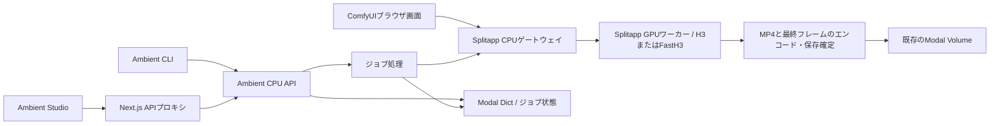

# H3 / FastH3 Ambient バックエンドとCLI

共有動画ライブラリ、Jevタグ付け、ComfyUIでの追従表示・編集については
[共有ライブラリとワークフロー編集](ambient-library.md)を参照してください。

このリポジトリは、[Ambient Studio](https://github.com/hndrr/ambient-studio)用のModalバックエンドを提供します。独立したフロントエンドが再生、FX、MIDI操作、Next.jsの `/api/ambient` プロキシを担当します。旧 `comfy-stream` のAmbient画面とプロキシは削除済みです。

`splitapp.py` と `ambient_app.py` を組み合わせて使います。SplitappはCPUでComfyUIの画面とAPIを提供し、生成時だけGPUワーカーでH3またはFastH3を実行します。AmbientはCPU上のジョブAPIとクリップ処理を担当します。どちらのモードもSplitapp経由でComfyUIを使い、両アプリは既存の認証とモデル・入力・出力用のVolumeを再利用します。フロントエンドのデプロイや表示では、モデルをダウンロードしません。

**現在の構成（2026-09-16）：** 採用を取りやめたFastVideoワーカー（`FastH3.*`）、そのGPUイメージ、スナップショットをダウンロードする `prepare_fasth3` は削除済みです。専用スナップショットも削除済みです。ComfyUI版FastH3と、そのINT8モデル・VAEは引き続きSplitappで使えます。

全H3 / FastH3モードの標準Video VAEは `minimax_h3_video_vae_int8_convrot.safetensors`、Audio VAEは `minimax_h3_audio_vae_fp32.safetensors` です。適用済みのカスタムワークフローは保存したモデル選択を維持します。

H3とFastH3は、どちらも動画のデコードに `MiniMaxH3FastVAEDecode` を `tile_batch_size=4` で使います。提供元は [Mozer/ComfyUI-MiniMax-H3-MotionCache-FastVAE](https://github.com/Mozer/ComfyUI-MiniMax-H3-MotionCache-FastVAE) の `b719329e0ecf35f0ae08d241c363ed1e56adbb95` です。音声は引き続き `VAEDecodeAudio` を使い、MotionCacheは接続していません。このノードは、新しく作るSplit環境のテンプレートに含まれます。既存環境では、通常のカスタムノード更新手順で同じ拡張を導入・検証してから、新しいAmbientの生成レシピをデプロイしてください。`check_comfy` と生成処理は、デコーダーがなければGPUジョブの投入前に拒否します。Fast VAEは公開ノードのスキーマに加えてH3 VAEの内部実装にも依存するため、ComfyUIの更新時には再確認が必要です。後述の測定値は、このデコーダー変更前のものです。

**Fast VAEの検証（2026-09-16）：** 使用中のSplit環境にノードを導入し、Ambientを再デプロイした後、両モードのプレビューでRTX PRO 6000による124フレームの音声付き動画を生成できました。ComfyUIの実行時間はFastH3（VSA）が39.27秒、H3が42.59秒でした。H3のデコーダーが記録した処理時間は5.34秒です。各1回の実行で、読み込み条件にも差があるため、デコーダー単体の高速化を示す測定ではありません。記録と出力クリップは `ambient/docs/validation/2026-09-16/fastvae/` にあります。

**GPUの検証（2026-09-15）：** H3は1基のRTX PRO 6000で両解像度の音声付き動画を生成でき、前のクリップを親としてつなぐ3本のプレビューも確認しました。ComfyUI版FastH3も、指定したINT8モデル・VAEと標準のVSAスパース生成経路で、両解像度の音声付き動画を生成できました。ローカルテストでは、ジョブの状態遷移、保持期間、失敗時の処理も検証しています。

## ComfyUIの実測結果（2026-09-15）

以下は、使用中のSplit環境でRTX PRO 6000 Blackwell Server Editionを1基使った測定です。環境はComfyUI 0.34.0、comfy-kitchen 0.2.33、PyTorch 2.10.0+cu130、CUDA 13.0です。各動画は24 fps・124フレームで、映像はH.264、音声はAACステレオです。FastH3は両解像度で標準のVSAスパース生成経路と指定したINT8動画VAEを使い、代表フレームが黒一色になっていないことを目視で確認しました。

| 生成経路 / 入力 | 解像度 | ComfyUI実行時間 | 起動を含むGPUワーカーの処理時間 | CLI実行からローカル保存まで | 観測したVRAM / コンテナRAM |
| --- | --- | ---: | ---: | ---: | ---: |
| H3 / テキスト、1本目 | 832×480 | 40.0 s | 63.3 s | 未計測 | 未計測 |
| H3 / 前の最終フレーム、2本目 | 832×480 | 55.8 s | 94.4 s | 401.6 s | 40.7 / 90.2 GiB |
| H3 / 前の最終フレーム、3本目 | 832×480 | 52.8 s | 75.9 s | 113.3 s | 40.8 / 90.2 GiB |
| H3 / テキスト | 1344×768 | 75.8 s | 96.2 s | 184.8 s | 39.9 / 89.7 GiB |
| FastH3 / テキスト | 832×480 | 47.3 s | 74.4 s | 125.7 s | 39.0 / 86.4 GiB |
| FastH3 / テキスト | 1344×768 | 51.4 s | 69.9 s | 387.6 s | 40.2 / 87.5 GiB |

ComfyUI実行時間は履歴上の開始から成功までで、ノード内の読み込みとメディア処理を含みます。CLIの時間には、リソース割り当て待ち、起動、処理、ポーリング、ダウンロードが含まれます。例えばFastH3の高品質設定では、Splitのキュー受付からワーカー開始の記録までに290.4秒かかりました。各1回の実行なので、エンジン速度のベンチマークではありません。メモリは約2秒間隔で観測した最大値で、コンテナRAMにはファイルキャッシュが含まれます。H3の2本目と3本目は同じGPUコンテナを使いましたが、ComfyUIプロセスは再起動しており、読み込み済みモデルをそのまま再利用した条件ではありません。初回実行ではポーリングのタイムアウト処理に不具合が見つかりました。ジョブを再投入せずに既存の結果を回収したため、CLIの所要時間と最大メモリは未計測です。

親クリップを順につないだH3の3本では、境界となる画像が維持されました。ComfyUIの実行後は、SplitのCPU制御接続を開いたままでもGPUコンテナ数がゼロになりました。ローカルの測定記録、ComfyUIのログ、リクエスト本文、MP4、詳細レポートは、Git管理対象外の `ambient/docs/validation/2026-09-15/` に保存されています。キャッシュされた `ready` の記録は、引き続き準備状態だけを表します。FastVideoの検証は、ユーザーの指示によりGPU割り当て前に中止しました。CLIの監視と制御接続を停止した後は、デプロイした両アプリのCPU/GPUコンテナがゼロになり、一時的な検証用アプリもすべて停止しました。

## 役割分担とデータの流れ



| ファイル | 役割 |
| --- | --- |
| `ambient_app.py` | Modalイメージ、リソース設定、リモート関数の宣言、依存関係の接続 |
| `ambient/api.py` | HTTPの検証、マルチパート解析、ステータスコード、レスポンスの生存期間の管理 |
| `ambient/service.py` | ジョブ受付、重複排除、状態の整合、キャンセル |
| `ambient/job_state.py` | ジョブ状態の読み取りと、キャンセル・完了で共有する最終結果のアトミックな確定 |
| `ambient/processing.py` | ジョブの生成、出力の最終処理、保存確定、結果公開。ローカルテスト用にストレージと生成処理を差し替え可能 |
| `ambient/storage.py` | Ambientのファイルパス、画像の正規化、親フレームの読み込み、Volumeへのアクセス |
| `ambient/comfy.py` | splitapp経由のComfyUI HTTP/WebSocket制御、ジョブ単位のキャンセル、結果のダウンロード |
| `ambient/split.py` | 接続先が分離モードで動作するSplit CPUゲートウェイであることの確認 |
| `ambient/h3.py` | 稼働中サーバーのノード定義に合わせた、標準H3・FastH3の生成レシピ |
| `ambient/models.py` | バージョンを固定したモデル一覧、チェックサム、参照元 |
| `ambient/client.py`、`ambient/cli.py` | 共用HTTPクライアントと、ブラウザを使わないジョブ操作コマンド |
| `ambient/media.py` | 音声必須のMP4エンコード、メタデータ検査、最終フレームの抽出 |
| `ambient/readiness.py` | 保存済みの対応機能・準備状態の記録と、明示的に実行するComfyUIのノード・モデル確認 |
| `ambient/urls.py` | バックエンドURLの検証と、プロキシ認証情報を守るためのリダイレクト制限 |
| `ambient/maintenance.py` | 終了したジョブとAmbient所有ファイルの保持期間の管理 |

ジョブ処理では、ストレージが両方のVolumeへの保存を確定し、キャンセルを再確認してから `completed` を確定します。完了・キャンセル・失敗は、既存のジョブDict内の単一レコード `terminal:<job_id>` を共有し、`put(skip_if_exists=True)` で書き込みます。最初に書き込まれた最終結果が優先され、その状態とクリップのメタデータを一緒に保存します。そのため、後から進捗や完了を書き込んでも確定済みのキャンセルは変わらず、遅れて届いたキャンセルによって完了済みクリップが見えなくなることもありません。既存のジョブ記録と旧形式のキャンセル記録も読み取れます。HTTPでの対応機能・準備状態の取得には、保存済みの記録だけを使います。AmbientにはGPUイメージもGPU関数もなく、ローカルの処理・ストレージテストにGPU依存ライブラリは不要です。

**分離モード**では、ComfyUIのブラウザタブを開いたままにしても、稼働し続けるのはCPU側のUIだけです。画面からの生成とAmbientからのH3・FastH3生成は、splitappのジョブキューとGPUワーカーを共有します。キューの処理が終われば、画面が開いていてもGPUはゼロ台まで縮退できます。CPUとストレージの使用は続く場合があります。現在のSplitappは `min_containers=0` で、アイドル状態から30秒で縮退します。明示的に選ぶ従来モードはGPUセッションを維持するため、AmbientのComfyUI生成経路はどちらもこのモードを拒否します。環境検証など、ほかの明示的なGPU操作については[分離構成のデプロイガイド](comfyui-split.md)を参照してください。

<a id="configuration"></a>

## 設定

リポジトリの `.env` と、接続先を固定した `.modal-profile` を使います。認証情報を `NEXT_PUBLIC_*` 変数に入れないでください。

```dotenv
AMBIENT_COMFYUI_URL=https://YOUR-WORKSPACE--comfyui-split-ui.modal.run
MODAL_PROXY_KEY=...
MODAL_PROXY_SECRET=...
```

`splitapp.py` のデプロイ時に表示される `ui` のURLを指定します。この構成では、通常の `comfyapp.py` のエンドポイントはH3用バックエンドではなく、デプロイも不要です。`ambient_app.py` は共通設定とVolume定義を使うために `comfyapp.py` をインポートしますが、インポートだけでそのアプリがデプロイされることはありません。

フロントエンドの `.env.local` には、**Ambient API**を指す `AMBIENT_BACKEND_URL` と、`MODAL_PROXY_KEY` / `MODAL_PROXY_SECRET` が必要です。フロントエンドは、このジョブAPIだけを経由してComfyUIへアクセスします。アセット管理画面や、ブラウザからComfyUIへの接続は不要です。

`MODAL_PROXY_KEY` と `MODAL_PROXY_SECRET` は、**接続先のModalワークスペースで発行したProxy Authトークン**のToken ID（`wk-...`）とToken Secret（`ws-...`）です。それぞれHTTPヘッダー `Modal-Key` と `Modal-Secret` として送信します。フロントエンドの接続先は `AMBIENT_BACKEND_URL`、AmbientバックエンドからComfyUIへの接続先は `AMBIENT_COMFYUI_URL` です。各環境に、その接続先に対応するペアを設定してください。ambientappとsplitappが同じワークスペースにあれば、両方の接続で同じペアを使えます。

同じ接続先をCloudflare Worker経由でも公開している場合、変数名の対応は次のとおりです。

| Ambient側の変数 | Workerが既定ペアを使う場合 | Workerが接続先別のペアを使う場合 |
| --- | --- | --- |
| `MODAL_PROXY_KEY` | `MODAL_KEY` の値 | `MODAL_PROXY_CREDENTIALS` 内の該当するModalオリジンの `key` |
| `MODAL_PROXY_SECRET` | `MODAL_SECRET` の値 | `MODAL_PROXY_CREDENTIALS` 内の該当するModalオリジンの `secret` |

Workerの既定ペアは特定の1ワークスペースに属し、別ワークスペースへの認証には使えません。Ambientが読むのは2つの値それぞれであり、WorkerのJSONマップではありません。設定も自動では同期されません。転送先と認証キーの優先順位は、[Workerの設定ガイド](cloudflare-access.md)を参照してください。例示にはすべてプレースホルダーを使っています。実際のサブドメイン、ワークスペース名、トークンの値は、環境変数またはシークレット保管先に保存してください。

バックエンドURLには、HTTPSと有効なホスト名を使います。URL内の認証情報、クエリ文字列、フラグメントは指定できません。Modalの認証ヘッダーが別の接続先へ転送されないよう、リクエストはリダイレクトを拒否します。H3アダプターとノード・モデル確認でHTTPを許可するのは、認証情報を使わないローカルテストのlocalhost・ループバック接続だけです。

Ambientは `comfyapp.py` の関数タイムアウト設定を再利用します。GPUリソースとその起動・終了はSplitapp側で設定し、Ambient自体はCPUのみで動きます。

### Ambient用ComfyUIの追加ノード

`ambient_app.py` の接続先である `splitapp.py` に、次の非公開リポジトリを追加します。

- [ComfyUI-AgentRuntime](https://github.com/hndrr/ComfyUI-AgentRuntime)
- [ComfyUI-Skills-Loader](https://github.com/hndrr/ComfyUI-Skills-Loader)
- [ComfyUI-GeminiTools](https://github.com/hndrr/ComfyUI-GeminiTools)
- [ComfyUI-Jev](https://github.com/hndrr/ComfyUI-Jev)

ModalにSecret `github-secret` を作り、`GITHUB_TOKEN` に4リポジトリの
Contentsを読み取れるGitHubトークンを登録してください。別名のSecretを使う場合は
`GITHUB_SECRET_NAME` で指定します。トークンはCPUの取得処理へ渡し、
ComfyUI子プロセス・GPU・Git remote URL・イメージには保存しません。

`.env` の `COMFYUI_AMBIENT_MODE=on` を設定してからデプロイします。一度だけ指定する場合は次の形です。

```sh
COMFYUI_AMBIENT_MODE=on ./scripts/modal.sh deploy splitapp.py
./scripts/modal.sh deploy ambient_app.py
```

デプロイ後の最初のアイドル起動で、4リポジトリのデフォルトブランチの最新HEADを
`git ls-remote`で確認します。変更されたリポジトリだけを、確認したSHAに固定して取得します。
実行中のチェックアウトへ直接更新を取り込まず、必要な取得がすべて成功してから既存環境を
複製して変更分を入れ替えます。依存パッケージをまとめてインストールし、既存の
CUDA等の依存制約とCPUでの4パッケージの読み込みを確認してからVolumeへ保存・反映します。
GPUはジョブに記録された同じ環境を使い、独自の更新取得や、更新確認のための起動は行いません。

最新SHAが同じならソースの取得・環境の複製・依存の再インストールを省略します。
確認済みデプロイIDとノードのSHAはコントローラーの永続状態に保存します。同じデプロイの
通常の再起動・スケールゼロからの復帰ではGitHubへアクセスせず、保存済みノードを再利用します。
最新の追加ノードを取り込むには `./scripts/modal.sh deploy splitapp.py` を再実行します。
内部の `SPLIT_AMBIENT_DEPLOYMENT` はデプロイ時に発行し、コンテナ再起動では維持します。
取得・依存関係の解決・インポートの失敗時は旧環境を維持し、CPUログに理由を出します。
旧環境に4つの有効なノードがある場合は、同じデプロイで更新を繰り返さず、再デプロイで再試行します。
初回導入が失敗した場合は追加ノードなしで起動し、次のアイドル起動でも導入を再試行します。
保存済みマニフェストが壊れている場合やノードが欠けている場合も再取得します。
未完了ジョブ、Managerの編集中環境、従来モードのセッションが残る起動では、次のアイドル起動まで
更新を延期します。CPU検査はノードのインポート検査であり、外部API・CLI実行やGPU推論の成功確認ではありません。

追加分は各環境の `ambient_nodes/` に保存し、モードがonの場合だけComfyUIの検索パスへ追加します。
通常の `comfyapp.py` と、モードoffのsplitappでは取得も読み込みも行いません。
無効化は `COMFYUI_AMBIENT_MODE=off` でsplitappを再デプロイします。
同名パッケージが既存の `custom_nodes/` に手動導入されている場合は、自動置換せず更新を止めて
重複をログに表示します。Managerでの他ノードの更新時も4つのスナップショットを引き継ぎます。

追加ノードのAPIキーとBridgeの接続トークンも、Modalに保存したSecretから読み込みます。
使うサービスのSecretを作成し、デプロイ元の環境変数または `.env` にはSecret名だけを指定してください。

| `.env` の設定例 | Modal Secret内のキー |
| --- | --- |
| `GEMINI_SECRET_NAME=gemini-secret` | `GEMINI_API_KEY` |
| `TYPESAFE_SECRET_NAME=typesafe-secret` | `TYPESAFE_API_KEY` |
| `OPENROUTER_SECRET_NAME=openrouter-secret` | `OPENROUTER_API_KEY` |
| `AGENT_RUNTIME_SECRET_NAME=agent-runtime-secret` | `AGENT_RUNTIME_BRIDGE_TOKEN` |

Secret名は既存のものを指定でき、空欄のサービスは使いません。
指定したSecretと必要なキーの存在はデプロイ時にModalが検査します。
AmbientモードのCPU/GPUへ同じSecretを渡し、コンテナ起動時にキーを環境変数へ注入します。
ローカルのAPIキーや `AGENT_RUNTIME_BRIDGE_TOKEN` の値はデプロイ設定に取り込みません。

Bridgeの接続トークンは、自分で生成するランダムな共有文字列です。たとえば手元で
`openssl rand -hex 32` を実行し、その値をModal Secretの `AGENT_RUNTIME_BRIDGE_TOKEN` に保存します。
`.env` に `AGENT_RUNTIME_SECRET_NAME=agent-runtime-secret` を設定してsplitappを再デプロイすると、
ComfyUIプロセスに注入されます。MacのNode.jsバックエンドにも同じ値を設定し、
`createAgentRuntimeBridge` の `bridgeToken` に渡します。上流サンプルではMac側の環境変数名は
`COMFY_BRIDGE_TOKEN` です。Reactの公開環境変数やワークフローJSONには入れません。

[上流Bridge](https://github.com/hndrr/ComfyUI-AgentRuntime/tree/main/packages/agent-runtime-bridge)
のMac側のバックエンドは、splitappのCPU `ui` URLへ接続します。Modalのプロキシ認証も必要なので、
`createAgentRuntimeBridge` の設定へ次を追加してください。これらもMac側のバックエンドの環境変数です。

```ts
headers: {
  "Modal-Key": process.env.MODAL_PROXY_KEY!,
  "Modal-Secret": process.env.MODAL_PROXY_SECRET!,
},
```

分離モードでは、CPUがMacの接続とモデル・Skill一覧を保持します。Bridgeノードを含む
ワークフローを実行すると、GPUのBridgeへ接続を中継し、接続完了後に生成を開始します。
入力ファイル・生成画像・実行結果もそのGPUジョブへ転送します。Bridgeへの接続や一覧の
取得だけではGPUを起動しません。GPUの終了後もMacとの接続は保持します。

Macの切断・GPUの終了・キャンセル時には進行中のBridge処理も終了し、失敗した処理を
自動再実行しません。待機中にMacが再接続された場合も、元の接続に紐づくジョブは失敗にします。
旧モードへ切り替える際はMacのBridgeを切断してください。環境更新中の新規接続は拒否します。
Mac側へのBridgeパッケージの組み込みとCodexログインは別途必要です。

[ModalのWebSocket上限](https://modal.com/docs/guide/webhooks)は1メッセージ2 MiBです。
Ambient StudioのMac側のバックエンドはHTTP転送を交渉し、256 KiBを超えるJSON本文をHTTPで別送します。
WebSocketには参照IDだけを流すため、大きなプロンプト・Skill本文・結果・CLIログも転送できます。
CPU/GPU間も同じ方式を使い、本文は接続ごとに認証し、受信・切断時に破棄します。
1メッセージ20 MiB、接続ごとの転送待ち本文は合計64 MiBまでです。
MacのCodex出力上限8 MiBと、画像1ファイル256 MiBの上流制限は維持します。
古いMac側のバックエンドから直接接続した場合は従来のWebSocket方式なので2 MiB上限が残ります。

デプロイ後の転送確認は `./scripts/modal.sh run scripts/check_agent_bridge.py` で実行できます。
実際のBridgeノードで入力画像・生成画像・3 MiBの依頼・6 MiBの実行結果を往復させ、保存画像を検査します。
GPUを1ジョブ起動しますが、応答は確認用の固定データで、Codexや外部の生成APIは呼びません。
Macが既に接続中の場合は接続を奪わず失敗します。

Skills Loaderのアップロード先 `input/skills/` は既存の入力Volumeへ保存され、GPUからも参照できます。
手元のPCのSkillやCLIのログイン情報は自動転送しません。

AgentRuntimeのCLIプロバイダーを使う場合は、Modal側にも対応CLIの導入と認証が必要です。
今回の自動取得はカスタムノード本体とPython依存が対象です。
4つのノードはComfyUIのワークフローから利用でき、Ambient Studioの画面やH3生成レシピに
自動で組み込まれるわけではありません。

## 明示的に実行する導入・準備手順（クラウド使用料が発生）

Modalの利用を再開する際は、次の手順を実行します。自動では実行されません。

1. 既存のモデル保存処理で、不足しているH3ファイルを用意します。
   `./scripts/modal.sh run scripts/prepare_ambient_h3.py`
   `Comfy-Org/MiniMax-H3` の `a98869194787969724c7425d95d0ed73ce9202af` と、配布元のモデルディレクトリ構成を使います。
2. 分離構成のUIとGPUワーカーをデプロイします。
   `./scripts/modal.sh deploy splitapp.py`
   `AMBIENT_COMFYUI_URL` をCPU側の `ui` エンドポイントに設定し、分離モードを維持します。Ambientが使うモード確認処理を含めるため、このブランチのゲートウェイをデプロイしてください。
3. APIとジョブ処理をデプロイします。
   `./scripts/modal.sh deploy ambient_app.py`
4. Split CPUゲートウェイが公開するComfyUIのノード・モデル一覧を確認します。
   `./scripts/modal.sh run ambient_app.py::check_h3`
   この操作でSplitのCPU UIが起動する場合がありますが、GPUワーカーは呼び出しません。最初に `/modal-control/v1/status` を確認し、従来モード、環境の切り替え中、未解決ジョブがある状態を拒否します。対応機能・準備状態の応答には、一覧の確認結果と、それとは別に `gpuValidated: false` が含まれます。APIでこの状態を取得するだけならDictしか使いません。通常のComfyUIエンドポイント向けの古い準備記録は、この確認で置き換える必要があります。
5. 明示的な動作確認スクリプトで、生成された音声と、親クリップを順につなぐ3本の動画を確認します。
   `python scripts/ambient_smoke.py --mode h3 --clips 3` を実行した後、`--mode fasth3 --clips 1` でも実行します。
   必要な環境変数は `AMBIENT_BACKEND_URL`、`MODAL_PROXY_KEY`、`MODAL_PROXY_SECRET` です。ダウンロードはローカルに保存されます。固定したバージョンを検証済みとする前に、音声を聴き、映像のつながりも目視で確認してください。

Studioを停止すると、後続の生成投入を止めてローカルの再生リソースを閉じます。受付済みのジョブは継続し、明示的な取消操作でキャンセルします。どちらのComfyUI生成経路でも、Ambientはsplitappの `/jobs/<prompt_id>/cancel` を呼び出します。キュー内のジョブは削除され、実行中のジョブにはそのワーカーだけを対象とする中断が送られます。ほかのUIクライアントのジョブには影響しません。GPUが直ちに停止するとは限りません。中断の完了とアイドル時の縮退を待つ必要があり、ほかにキュー内のジョブがあれば稼働を続けます。ジョブ処理自体の実行タイムアウトは終了として扱い、ポーリングを続けません。ゼロ台への縮退は引き続き有効です。

プロンプト投入後にAmbientの生成期限またはHTTPリクエストがタイムアウトした場合も、アダプターは同じジョブへキャンセルを送ります。このリクエストには別途10秒のタイムアウトがあります。キャンセルを確認できなければ、エラーにその旨を表示します。再試行前にComfyUIの履歴を確認してください。プロンプトIDが不明な場合はキャンセルを送りません。

## CLIでモデルを選ぶ

CLIとバックエンドの変更は、このリポジトリに含まれます。全モードの既定バックエンドはComfyUIです。GPUプロファイルは自動で切り替わりません。

2026-09-20にStudioとAPIへ8-step V2の2モードを追加しました。既存設定のモードは自動変更しません。

| mode | Studioの選択肢 | 入力・Attention |
| --- | --- | --- |
| `h3` | H3 Continuity · 8 step Turbo | テキスト／画像、従来のTurbo LoRA |
| `h3-turbo-4step` | H3 Turbo · 4 step | テキスト／画像、既存Turbo LoRAを4stepで実行 |
| `h3-fused-4step` | H3 Fused + Mystic · 4 step | テキスト／画像、Turbo・Mystic統合済みモデル |
| `fasth3` | FastH3 · 4 step VSA | テキスト、従来の4-step VSA |
| `fasth3-8step-t2v` | FastH3 V2 · 8 step T2V | テキスト、VSA |
| `fasth3-8step-i2v` | FastH3 V2 · 8 step I2V (experimental) | 開始画像必須、sol-attn |

新モードは `FastVideo/FastVideo-FastH3-Comfy` の `fastvideo_fasth3_8step_v2_pruned_int8_convrot.safetensors`、`res_multistep` / `simple` / 8 steps、video/audio shift 10/3を使います。Qwen NVFP4、Kijai INT8 Video VAE、FP32 Audio VAEと既存Fast VAE Decodeを再利用します。

[指定記事](https://note.com/kongo_jun/n/n4e6fe1a076ab)の添付グラフに合わせ、T2VはVSA keep 10%、I2Vはsol-attn tau 1.3です。両方ともstart 0.2 / end 1 / min_tokens 12288 / extra_tokens 256 / sink exact_kv_and_rows。I2Vは[元モデルの蒸留対象外](https://huggingface.co/FastVideo/FastVideo-FastH3-8-Step-V2)のため実験扱いです。9月16日のVSAによるI2V実測は、今回のsol-attnレシピの品質・速度検証には流用しません。

I2Vの開始画像はアップロード、カメラ、CodexのGenerate first frame、ComfyUIで固定したreferenceから選べます。同系統の次の動画は最後の成功動画の終端フレームを引き継ぎます。画像がないときは停止して説明し、T2Vへ自動変更しません。ComfyUI側の各グラフも独立したstageとして編集・版管理します。

モデル未配置の場合だけ `scripts/modal.sh run scripts/prepare_ambient_h3.py --mode fasth3-8step-t2v` を実行します（両新モードの資産は共通）。準備確認は各モードで `scripts/modal.sh run ambient_app.py::check_comfy --mode fasth3-8step-t2v` / `--mode fasth3-8step-i2v`。ノード・資産の在庫確認はCPUのみで、GPU検証とは区別します。CLIでは `python -m ambient.cli generate --mode fasth3-8step-i2v --image first-frame.png --prompt ... --sound ...` を使います。

通常のPython依存パッケージをインストールし、`AMBIENT_BACKEND_URL`、`MODAL_PROXY_KEY`、`MODAL_PROXY_SECRET` を環境変数として設定します。URLはAmbient APIを指します。準備状態、既存ジョブ、完了済みクリップの取得では、生成用GPUは起動しません。

### H3 Turbo／Fusedの4step設定

`h3-turbo-4step`は現行H3の重みとTurbo LoRAを再利用し、`h3-fused-4step`は[MATLOWAIのFused Turbo + Mystic](https://huggingface.co/MATLOWAI/minimax-h3-fused-turbo-int8-convrot)を使います。両方とも単段の`res_multistep` / `simple` / 4 steps、video/audio shift 12/3、BasicGuider（CFGなし）です。初期設定は既存のdense Attention経路を使います。配布元のSLA拡張や4+4 de-ropeを追加した構成とは異なり、その速度の実測値は引き継ぎません。AttentionなどはComfyUIの各stageで編集できます。

Fusedは`minimax_h3_fused_refdelta_r1024_turbo8_mystic07_int8_convrot.safetensors`（約21 GB）を標準UNETLoaderで読み込み、Turboを二重適用しません。Mysticの強度0.7は組み込み済みで、後からその強度だけを変える設定はありません。映像VAEは既存のKijai INT8、テキストエンコーダー・音声VAEは共通です。取得元のリビジョンとSHA-256は`ambient/config.py`と`ambient/models.py`で固定しています。

StudioのGeneration → Modelで選択できます。どちらも画像なしでT2Vを実行でき、画像アップロード・カメラ・Codex開始画像・成功動画の最終フレーム継承も使えます。既存`h3`の8step設定や保存済みワークフローは自動変更しません。新しいmodeごとにComfyUIドラフト・適用版・準備記録を持ち、通信再試行も元のmodeを維持します。

サーバーへ反映する際は更新した`splitapp.py`／`ambient_app.py`を配備し、Fusedの重みが未配置なら明示的に準備します。これらの操作はテストやStudio起動からは実行されません。

```sh
# Fusedのモデル準備（既存Turbo 4stepの資産はh3と同一）
./scripts/modal.sh run scripts/prepare_ambient_h3.py --mode h3-fused-4step
# 各レシピの在庫・ノード契約を確認。実GPU生成は行わない。
./scripts/modal.sh run ambient_app.py::check_comfy --mode h3-turbo-4step
./scripts/modal.sh run ambient_app.py::check_comfy --mode h3-fused-4step
```

モデルが準備されていない場合は未準備として表示し、別モデルへ自動変更しません。2026-09-20にFused本体のSHA-256照合・共有Volumeへの保存を完了した後、SplitappとAmbient APIへ反映しました。実サーバーのノード・モデル契約を確認し、両4stepモードが`ready: true`、各ComfyUI stageが4stepで公開されることを確認しています。既存4モードも準備状態を維持しています。両4stepレシピの実GPU品質・速度は未検証です。[配置・反映の記録](../ambient/docs/validation/2026-09-20/h3-four-step-deploy/README.md)

### CLIの基本操作

```sh
python -m ambient.cli capabilities
python -m ambient.cli status JOB_UUID
python -m ambient.cli cancel JOB_UUID
python -m ambient.cli download JOB_UUID --output ./ambient-output
```

次のコマンドは生成ジョブを投入します。デプロイ済みのバックエンドを指定すると、設定したクラウドリソースの使用料が発生します。`--backend comfyui` は省略できます。

```sh
python -m ambient.cli generate --mode fasth3 --backend comfyui \
  --prompt "A quiet sunlit room, still camera" --sound "Soft breeze and distant leaves" \
  --seed 42 --resolution preview --output ./ambient-output
```

8ステップのH3には `--mode h3` を指定します。H3では `--image ./anchor.png` または `--parent-clip-id JOB_UUID` を使えます。生成時の既定値はシード42、プレビュー解像度、待機時間3600秒です。待機時間は `--timeout` で変更できます。

CLIはジョブをPOSTする**前に**、`JOB_UUID.request.json` を表示・保存します。タイムアウトや応答の消失が起きても、新しいIDで再生成しないでください。まず元のジョブを確認します。再送が必要なら、保存した本文を使います。

```sh
python -m ambient.cli submit ./ambient-output/JOB_UUID.request.json --output ./ambient-output
```

同じリクエストなら、準備状態が後から変わっていても、サーバーは既存のジョブを返します。同じIDで本文またはエンジンが異なる場合は409を返します。出力ファイルは `JOB_UUID.mp4` と `JOB_UUID.json` です。JSONにはモード・バックエンドと、想定する参照元 `references` が含まれますが、どの重みをGPUで検証したかの証明にはなりません。ダウンロードを中断しても、ローカルの既存の完了済みファイルは保持します。Ctrl+Cは、このCLIのジョブにキャンセルを要求して応答を表示します。GPUの終了には、中断の完了と縮退が引き続き必要です。

### ComfyUI用FastH3の準備

次の導入・準備コマンドは、明示的に実行するとクラウド使用料が発生します。CLI、アプリ起動、テスト、対応機能・準備状態の取得から自動実行されることはありません。

```sh
./scripts/modal.sh run scripts/prepare_ambient_h3.py --mode fasth3
./scripts/modal.sh run ambient_app.py::check_comfy --mode fasth3
```

新しい生成経路を使う前に、更新した `splitapp.py` と `ambient_app.py` をデプロイしてください。モデル保存処理は `Kijai/MiniMax-H3-experimental` のリビジョン `f4cac997f880e93cf6940af61ee8d58ef31ff7f3` から、次のファイルを取得します。

- `/models/diffusion_models/minimax_h3_fastvideo_vsa_datafree_1300step_4step_int8_convrot.safetensors`
- `/models/vae/minimax_h3_video_vae_int8_convrot.safetensors`

両ファイルとも、共有モデルファイルを置き換える前にSHA-256を確認します。QwenテキストエンコーダーとFP32の**音声**VAEは、既存のバージョン固定済み `Comfy-Org/MiniMax-H3` から取得します。H3の生成レシピも同じINT8動画VAEを使い、8ステップ用LoRAを維持します。拡散モデルのファイル名にある `fastvideo` は配布元による命名の一部です。このファイルはComfyUIで読み込み、削除済みのFastVideoランタイムは必要としません。

FastH3の生成レシピは、Eulerの全4ステップで保持率10%の標準VSAを使います。CFG=1、動画・音声のシフト値は12/3、シフトを適用した5点のシグマスケジュールを使います。標準のDynamicComboの選択肢と入れ子のフィールドは、稼働中サーバーの `/object_info` に合わせて接続します。ComfyUIの実行コードはコピーも変更もしません。

配布元によると、INT8動画VAEにはComfyUI 0.31.0以降が必要です。現在のSplitappはComfyUI 0.36.0（`7a0b5eede3f9721c8faab290689893f36edc6d66`）をデプロイし、使用中の環境で `comfy-kitchen==0.2.34` とフロントエンド1.52.7を確認済みです。このリビジョンには [MiniMax-H3 VAEの最適化（#16187）](https://github.com/Comfy-Org/ComfyUI/pull/16187) が含まれます。CPUでの起動と、RTX PRO 6000でのデコード単体の比較に成功しています。832×480・124フレームで、標準VAEとFast VAE（バッチ数4）の中央値はそれぞれ1.797秒と1.724秒で、デコード後のテンソルは一致しました。この更新ではH3・FastH3の生成全体は再検証していません。前述の生成時間の測定には0.34.0を使いました。

イメージのビルドでは、依存パッケージのインストール後に、配布元が固定するkitchenのバージョンを確認します。候補の仮想環境は、有効化前に保護対象の依存パッケージを確認します。CPUゲートウェイは、実際に使うPython環境のkitchenのバージョンとAPIの有無を報告します。FastH3は準備時と**ジョブ投入前**にこの報告を確認します。既存の仮想環境がイメージ内のkitchenより優先され、互換性のないバージョンを読み込む場合は、CPUゲートウェイが報告し、FastH3の事前確認で拒否します。修復にはSplit環境の更新手順を使ってください。イメージを再ビルドしただけでは、既存環境が変わったことの確認にはなりません。このFastH3用の確認が、CPU UI全体の起動を妨げることはありません。

CPUでの確認では、GPUカーネルが利用可能かどうかまでは調べません。GPUで検証する際は、ComfyUI・kitchen・PyTorch・CUDAのバージョンとGPUの種類を記録し、`comfy_kitchen.sol_attn_is_available(device)` と標準のスパースアテンションのログを確認してください。密なアテンションに切り替わった実行は、VSAの検証成功として扱いません。

`check_comfy --mode h3` は従来のH3生成経路を確認します。`check_h3` も互換用の入口として残っています。準備記録は保存済みの参照元と照合するため、生成レシピを更新したら再確認が必要です。対応機能・準備状態はキャッシュされるので、同じURLのまま環境を変更した場合も更新してください。古いFastVideoの準備記録は無視します。

後でGPUの動作確認を行う場合は、次を実行します。

```sh
python scripts/ambient_smoke.py --mode h3 --backend comfyui --clips 3
python scripts/ambient_smoke.py --mode fasth3 --backend comfyui --clips 1
```

## HTTP API仕様

デプロイしたすべての経路にModal Proxy Authが必要です。Next.jsのプロキシがサーバー側で認証情報を付与します。

- `GET /capabilities`：モード、解像度、124フレーム・24fpsに加え、`modes[mode].backends.comfyui` の準備状態・理由・検証情報を返します。モード全体の準備状態は、両モードとも `defaultBackend: comfyui` についての情報です。
- `POST /images`：マルチパートの `image` フィールドを受け付けます。上限は12 MiB・2400万画素で、`{id}` を返します。
- `POST /jobs`：本文は `{requestId,mode,backend?,prompt,sound,seed,resolution,imageId?,parentClipId?}` です。JSON解析前のストリーム受信時点で本文全体を128 KiBに制限し、超過時はジョブを投入せず413を返します。UUIDのリクエストIDはアトミックに確保します。同じ内容なら既存ジョブを返し、同じIDで内容が異なれば409を返します。`mode` は上表の6種類、解像度は `preview` または `quality` です。`fasth3` / `fasth3-8step-t2v` は画像・親クリップを拒否します。`fasth3-8step-i2v` は画像・親クリップ、または版固定したComfyUIワークフローのreferenceを必要とします。音声の指定は必須です。`backend` は `comfyui` だけを受け付けます。明示的な `fastvideo` の要求は400を返します。保存済みの古いFastVideoジョブは、バックエンド未記録の旧FastH3ジョブも含め、元のバックエンド情報を維持します。それらのIDをComfyUI用に再利用すると409を返し、新たな生成は行いません。
- `GET /jobs/:id`：`queued/running/completed/failed/cancelled` の状態、モード・バックエンド、新規ジョブで想定する参照元、処理段階・エラーを返します。完了時は、実際の寸法・長さ・フレーム数・`hasAudio` を含むクリップのメタデータも返します。
- `DELETE /jobs/:id`：キュー内または実行中のジョブについて、キャンセルを最終結果として確定しようとします。完了または失敗が先に確定していれば、その結果を返します。`cancelled` の応答は確定済みであり、後からワーカーが書き込んでも完了や失敗には変わりません。完了・失敗・キャンセル済みのジョブは、現在の状態をそのまま返します。完了したクリップは引き続きダウンロードでき、親クリップにも使えます。H3アダプターは自分のsplitappジョブだけをキャンセルし、全体を対象とする `/interrupt` は送りません。
- `GET /clips/:id`：永続保存されたH.264/AACのMP4を返し、バイト範囲の指定に対応します。CPU側のVolume SDKでファイルを取得するため、GPUは起動しません。

ComfyUIへのアップロードには `ambient/uploads`、未加工の出力には `ambient/raw` を使います。最終MP4は `comfy-outputs/ambient/clips/<id>.mp4`、デコードした最終フレームをそのまま保存する先は `comfy-inputs/ambient/frames/<id>.png` です。アップロードしたアンカー画像は `comfy-inputs/ambient/images/<id>.png` に置きます。`completed` を公開する前に、両方の最終成果物の保存を確定します。ffmpegは音声ストリームを必須とし、音声がない場合や映像と音声の長さが一致しない場合はジョブを失敗にします。最終処理では、成功・失敗のどちらでも `.part.mp4` を削除します。24時間の保持期限に従う削除処理では、終了したワーカーが残した未完成クリップも、Ambient所有のファイルやジョブ記録（最終結果の確定記録を含む）と一緒に削除します。ほかのComfyUIアセットやモデルは削除しません。

バックエンドは制御専用のWebSocketでsplitappのCPUゲートウェイに接続し、進捗を受信します。バイナリのプレビューはブラウザへ転送しません。履歴をポーリングして完了を確認し、splitappがワーカーの保存確定済みVolumeを再読み込みした後に、`/view` で出力を取得します。ComfyUIのキューからAmbientのジョブをキャンセルした場合も、Ambientの待機は終了します。プロンプト投入後に制御接続やワーカーが切れた場合は、上流の結果を確定できない旨を表示してジョブを失敗にし、GPUへ2件目のプロンプトを投入しません。ジョブ起動処理が異常終了しても、同じIDのワーカーを再起動する形では再試行しません。HTTPの再送には元のIDを使います。

キュー内のジョブについて、300秒たっても起動確認が保存されなければ、状態は `queued` のまま、処理段階を `Dispatch unconfirmed` にします。確認記録がないだけでは、ワーカーが起動したかどうかは判断できません。ポーリングで遅れて完了を検出することはでき、同じリクエストを再送しても再度の起動は行いません。CLIの待機期限も引き続き適用します。起動未確認の状態が続く場合は、Modalで状況を調べるか、既存ジョブをキャンセルしてください。

AmbientはComfyUIで生成するたびに、バージョン付きの分離構成用制御APIを確認します。リクエストには `X-Modal-Execution-Mode: split` も付けます。確認から投入までの間にUIが従来モードへ変わった場合、ゲートウェイは従来のGPUセッションへ転送せず、要求を拒否します。これは実行モードの条件であり、認証とは別です。Modal Proxy Authも引き続き必要です。

ComfyUIの制御リクエストは、全体で120秒のタイムアウトです。動画のダウンロードは、接続まで30秒、データ受信の間隔は120秒を許容し、生成処理全体の期限も適用します。そのため、転送が進んでいれば120秒を超えても生成結果を失わずにダウンロードできます。

## ComfyUIの更新への対応

AmbientはsplitappのComfyUIデプロイを使い、上流のソースにはパッチを当てません。ComfyUIを更新しても、ジョブ・通信・ストレージの修正を再適用する必要はありません。ただし互換性は、分離構成用の制御API、`ambient/comfy.py` が使うComfyUIのHTTP API、`ambient/h3.py` が接続するH3・FastH3のノードと入力の仕様に依存します。

分離構成と同様に、実行処理は上流の実装に任せ、互換性の調整は外部アダプター内で行います。生成のたびに稼働中サーバーの `/object_info` を読み、公開されている入出力の型に基づいて接続します。複数の出力が同じ型なら名前も使います。新たに必須となった入力には、その一覧に明示された既定値を使い、出力スロット番号は固定しません。SaveVideoも、稼働中のコンテナ形式・コーデックの仕様に合わせます。現在のComfyUIでは、入れ子になった `format.codec` のDynamicCombo入力も対象です。`check_comfy` と互換用の `check_h3` でも同じ接続処理を使い、両解像度とアンカー画像の有無を確認します。モデルの選択、8ステップのTurbo・4ステップのVSA生成レシピ、Ambientの出力仕様は、引き続きアプリ側の設定です。

そのため、明示的な既定値を持つ入力の追加や、出力スロットの並べ替えには、アダプターを変更せず対応できます。必須ノード・入力の削除や名前変更、モデルの不足、接続先を一意に決められない場合は、プロンプト投入前に失敗します。これは接続仕様の確認であり、ComfyUIの検証処理を置き換えるものではありません。splitappが要求をキューに入れ、そのGPUワーカーが標準のComfyUI `/prompt` エンドポイントを呼び、最終検証と標準の実行処理を行います。ノード実行、サンプラー、ローダー、ComfyUIの検証コードはAmbientへコピーしません。

上流の新しいリビジョンを採用するには、`splitapp.py` の `COMFY_REVISION` と対応する依存パッケージの固定バージョンを更新し、更新ガイドに従ってsplitappを再ビルド・デプロイします。通常アプリ用の環境変数 `COMFYUI_REVISION` は、splitappの固定バージョンを上書きしません。`check_h3` を再実行し、現在のノード一覧に対して対応する生成レシピの接続を確認してください。その後、親クリップを順につなぐ3本の音声付き動画を含むH3の動作確認を明示的に実行します。ノード・モデル一覧の確認は一部の検証にすぎず、それだけで生成の互換性は判断できません。ノードやAPIの仕様が変わった場合は、アダプターと回帰テストを調整します。`COMFYUI_REFERENCE` は、そのソースリビジョンでワークフローを確認してから更新してください。

`COMFYUI_REFERENCE` はアダプターの参照元を記録する値であり、それ自体でデプロイ先のサーバーを固定するものではありません。対応機能・準備状態にはURLをキーとする準備記録のキャッシュを使うため、同じURLでComfyUIを更新しても、その状態は自動で無効化されません。生成時は毎回、投入前に最新のノード定義を読みます。更新後は準備確認も再実行し、対応機能・準備状態を更新してください。現在のCIはローカルの代替実装を使い、最新の上流ComfyUIや実GPUでは実行していません。FastH3は、前述の標準ノードとkitchenの仕様に従います。

## ローカルでの検証

音声と最終フレームの回帰テストを実行するには、`ffprobe` を含む `ffmpeg` をインストールします。CIでは、このテストがスキップされないよう明示的にインストールしています。

```sh
uv sync --locked --extra ambient-test
uv run --locked --extra ambient-test python -m unittest discover -s tests -v
```

テスト対象は、重複実行の防止と競合、ジョブ起動の失敗・ワーカーのタイムアウト、入力機能の制限、マルチパート検証、範囲指定での配信、音声必須のエンコードと最終フレーム抽出です。結合テストでは、実際のSplitゲートウェイに対して、ComfyUIとModalをローカルの代替実装に置き換えてAmbientを動かします。GPUを起動しない画面表示とノード・モデル一覧の取得、アンカー画像のアップロード、キュー経由の生成、Volume再読み込み後の結果取得、待機中・実行中のジョブ単位のキャンセル、UIからのキャンセルを確認します。事前確認後の切り替えも含め、従来モードの拒否も検証します。

ジョブ処理のテストでは、生成前・生成後・保存確定中のキャンセル、生成・エンコード・保存確定の失敗、両方のアンカー入力方式、削除対象の境界も確認します。回帰テストは、廃止したFastVideoの要求とジョブの拒否、終了済みジョブのキャンセル、未完成ファイルの削除、HTTPS・リダイレクトの検証、進行中・停止中・期限に達したダウンロードを対象とします。これらのテストだけでは、実際のGPU生成や縮退の動作までは確認できません。

最終結果のテストでは、キャンセルとワーカーの最終書き込みを両方の順序で実行します。失敗処理と状態整合処理の競合、新しいサービスからの復元、再起動を伴わない同一要求の再送、旧形式の記録、ダウンロードの可否、最終結果の確定記録の削除も確認します。条件付き書き込みには、リクエストの重複排除と同じ [Modal Dictの機能](https://modal.com/docs/sdk/py/latest/Dict#put) を使います。追加のストレージや常駐プロセスは不要です。

参考：[ComfyUI標準のH3ワークフロー](https://docs.comfy.org/tutorials/video/minimax/minimax-h3)、[KijaiのComfyUI用FastH3モデルとINT8動画VAE](https://huggingface.co/Kijai/MiniMax-H3-experimental/tree/f4cac997f880e93cf6940af61ee8d58ef31ff7f3)。
