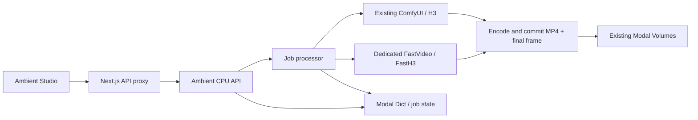

# H3 Ambient backend

This repository provides the Modal backend for [Ambient Studio](https://github.com/hndrr/ambient-studio). The standalone frontend owns playback, FX, MIDI controls and the Next.js `/api/ambient` proxy. The former `comfy-stream` Ambient screen and proxy have been removed.

`ambient_app.py` declares the CPU job API and the separate FastVideo GPU worker. It reuses the existing ComfyUI configuration, authentication and Volumes. Deploying or opening the frontend does not download models.

**Current validation:** local and CI tests cover the API, job lifecycle, retention and media processing, with mocked ComfyUI/FastVideo generation. No deployment or GPU generation was performed. ComfyUI/FastVideo/model references below are reproducible source references, not GPU-qualified releases. GPU generation, three-clip visual continuity and actual model performance remain to be checked when GPU use is explicitly resumed.

## Responsibilities and data flow



| File | Responsibility |
| --- | --- |
| `ambient_app.py` | Modal images, resource settings, remote function declarations and dependency wiring |
| `ambient/api.py` | HTTP validation, multipart parsing, status codes and response lifetimes |
| `ambient/service.py` | Job acceptance, deduplication, status reconciliation and cancellation |
| `ambient/processing.py` | Generate, finalize, commit and publish a job; storage and generators are injected for local tests |
| `ambient/storage.py` | Ambient file paths, image normalization, parent-frame loading and Volume access |
| `ambient/comfy.py` | Standard ComfyUI HTTP/WebSocket control, cancellation and result download |
| `ambient/h3.py` | Ambient H3 recipe bound to the running server’s node definitions |
| `ambient/fasth3.py` | FastVideo model loading, generation and shutdown inside its GPU image |
| `ambient/media.py` | Audio-required MP4 encoding, metadata inspection and final-frame extraction |
| `ambient/readiness.py` | Saved capability records and the explicit ComfyUI inventory check |
| `ambient/urls.py` | Backend URL validation and redirect protection for proxy credentials |
| `ambient/maintenance.py` | Retention of terminal jobs and Ambient-owned files |

The processor publishes `completed` only after storage has committed both Volumes and cancellation has been checked again. HTTP capability reads use saved records only. The FastVideo library is imported when its engine loads, so CPU-only tests can exercise the processing and storage code without installing GPU dependencies.

## Configuration

Use the repository's `.env` and pinned `.modal-profile`. Do not put credentials in `NEXT_PUBLIC_*` variables.

```dotenv
AMBIENT_COMFYUI_URL=https://YOUR-EXISTING-COMFYUI-ENDPOINT.modal.run
MODAL_PROXY_KEY=...
MODAL_PROXY_SECRET=...
AMBIENT_FASTH3_MODEL_REVISION=5ea076f35b84da4c3c82217112fa733d8eea2ae1
# Optional exact ComfyUI checkout when building the EXISTING ComfyUI app:
COMFYUI_REVISION=5bbdf8a76678e2c7cfb519a49a9c3a7137fd6280
```

The frontend's `.env.local` needs `AMBIENT_BACKEND_URL` pointing to the **Ambient API**, plus `MODAL_PROXY_KEY`/`MODAL_PROXY_SECRET`. It accesses ComfyUI only through this job API. Neither asset-management UI nor a browser ComfyUI connection is required.

Configured backend URLs must use HTTPS and a valid host, without embedded credentials, query strings or fragments. Requests reject redirects so custom Modal auth headers cannot be forwarded to another endpoint. Only the low-level ComfyUI adapter permits HTTP to localhost/loopback for credential-free local tests.

`GPU_PROFILE`, function timeout and scale-down behavior are reused from `comfyapp.py`. FastVideo has its own CUDA 13 image and uses one GPU, text encoder/VAE offloading, VSA-H3 with the Triton kernel and no FA4. FastVideo code is fixed at `556ac7088e7b4750806d277d31e0db6cd25a5238`. Dependencies follow that revision's `[fasth3]` installation recipe. GPU memory suitability and dependency/image build must still be validated on the chosen profile; the upstream speed claim uses four B200s and is not a promise for this single-GPU configuration.

## Explicit provisioning (incurs cloud usage; not automatic)

When ready to use Modal again:

1. Prepare missing H3 files using the existing model saver:
   `./scripts/modal.sh run scripts/prepare_ambient_h3.py`.
   This uses `Comfy-Org/MiniMax-H3` at `a98869194787969724c7425d95d0ed73ce9202af` and its original model directories.
2. Build/deploy the existing ComfyUI app if it needs the optional pinned revision or ffmpeg:
   `./scripts/modal.sh deploy comfyapp.py`.
3. Prepare the separate FastVideo snapshot:
   `./scripts/modal.sh run ambient_app.py::prepare_fasth3`.
   All component files, tokenizers and configs go to `/models/ambient-fasth3/<revision>` on `comfy-model`. The model uses `modular_model_index.json`. Downloads finish and commit before readiness is recorded.
4. Deploy the new API/worker:
   `./scripts/modal.sh deploy ambient_app.py`.
5. Check the existing ComfyUI native node/model inventory:
   `./scripts/modal.sh run ambient_app.py::check_h3`.
   **This contacts/wakes ComfyUI**, but does not submit a generation. Capabilities report the inventory result, model snapshot readiness and separate `gpuValidated: false` status. API capability reads themselves use Dict only, so they never wake a GPU.
6. Run the explicit smoke script for native audio and three parent-linked clips:
   `python scripts/ambient_smoke.py --mode h3 --clips 3`, then `--mode fasth3 --clips 1`.
   Environment: `AMBIENT_BACKEND_URL`, `MODAL_PROXY_KEY`, `MODAL_PROXY_SECRET`. Downloads are saved locally; listen and visually inspect continuity before qualifying these pins.

Stopping the studio cancels its pending job and closes local resources. An already-running shared ComfyUI prompt is logically cancelled and drained rather than globally interrupted; it can still incur usage until it finishes. FastH3 polls its dedicated Modal call every five seconds and cancels that call when cancellation is observed. A worker execution timeout is terminal, not a reason to keep polling. Scale-to-zero remains enabled.

## HTTP contract

All deployed routes require Modal Proxy Auth. The Next.js proxy supplies it server-side.

- `GET /capabilities`: supported modes, preparation status, resolutions, 124 frames / 24fps.
- `POST /images`: multipart field `image`, at most 12 MiB and 24 megapixels; returns `{id}`.
- `POST /jobs`: `{requestId,mode,prompt,sound,seed,resolution,imageId?,parentClipId?}`. UUID request IDs are atomic claims. Same content returns the existing job; different content with the same ID returns 409. `mode` is `h3` or `fasth3`, resolution `preview` or `quality`. FastH3 rejects all image/parent inputs. Sound is mandatory.
- `GET /jobs/:id`: `queued/running/completed/failed/cancelled`, stage/error, completed clip metadata with actual dimensions/duration/frame count and `hasAudio`.
- `DELETE /jobs/:id`: for queued/running jobs, marks an independent cancellation tombstone. Late writes cannot un-cancel the job. Completed, failed and already-cancelled jobs return their current state unchanged; completed clips remain downloadable and usable as parents. A cancellation accepted while a job is active wins over a concurrent completion. The worker deletes only its own queued ComfyUI prompt; it never calls `/interrupt`.
- `GET /clips/:id`: durable H.264/AAC MP4, supports byte ranges. CPU-side Volume SDK materialization; no GPU wake-up.

ComfyUI upload uses `ambient/uploads`, raw output uses `ambient/raw`. Final MP4s are `comfy-outputs/ambient/clips/<id>.mp4`; exact decoded final frames are `comfy-inputs/ambient/frames/<id>.png`. Uploaded anchors are `comfy-inputs/ambient/images/<id>.png`. Both final artifacts commit before `completed` is published. ffmpeg requires an audio stream; missing audio or A/V duration mismatch is a failed job. Finalization removes its `.part.mp4` on success or failure. The 24-hour retention task also removes leftover partial clips from terminated workers, along with Ambient-owned files and terminal job records, never other ComfyUI assets or models.

A backend control-only WebSocket keeps ComfyUI alive and drains progress without forwarding binary previews to the browser. History is polled for completion. If the control connection or worker dies after prompt submission, the job fails with an uncertain-upstream-result message rather than submitting a second GPU prompt. Dispatch crashes are never retried by re-spawning the same ID. HTTP retry uses the original ID.

ComfyUI control requests have a 120-second total timeout. Video downloads instead allow 30 seconds to connect and 120 seconds between received data, while remaining bounded by the generation deadline. A progressing transfer can therefore take longer than 120 seconds without losing its generated result.

## Following ComfyUI updates

Ambient runs alongside ComfyUI and does not patch its source. Updating ComfyUI does not require reapplying these job, transport or storage fixes. Compatibility still depends on the HTTP APIs used by `ambient/comfy.py` and H3 node/input contracts bound by `ambient/h3.py`.

Like the split deployment, the integration leaves upstream execution in place and confines compatibility handling to an external adapter. Before each generation, Ambient reads the running server’s `/object_info`, binds connections by the advertised input/output types (and names where outputs share a type), and takes explicit defaults for newly required inputs from that catalog. It does not retain fixed output slot numbers. The same binding is used by `check_h3` for both resolutions and with/without an anchor. Model choices, the eight-step Turbo recipe and the Ambient output contract remain application settings.

Added inputs with explicit defaults and reordered output slots can therefore be adopted without changing the adapter. Removed/renamed required nodes or inputs, missing models and ambiguous connections fail before prompt submission. This is a binding check, not a replacement for ComfyUI’s validator: the standard `/prompt` endpoint still performs final validation and runs the native implementations. No node execution, sampler, loader or ComfyUI validation code is copied into Ambient.

To adopt an upstream revision, set `COMFYUI_REVISION` to its full commit SHA and rebuild/deploy the existing ComfyUI app. Run `check_h3` again to bind the supported recipes against the current node catalog, then run the explicit H3 smoke test, including three parent-linked audio/video clips. The inventory check is partial and cannot establish generation compatibility. If node or API contracts changed, adjust the adapter and its regression tests, and update `COMFYUI_REFERENCE` only when the workflow has been checked against that source revision.

`COMFYUI_REFERENCE` documents the adapter's source reference; it does not pin the deployed server by itself. Capabilities use a cached preparation record keyed by URL, so updating ComfyUI at the same URL does not automatically invalidate that cached status. Generation always reads fresh node definitions before submission; re-run preparation checks after each update to refresh capabilities as well. Current CI uses local doubles, not the latest upstream ComfyUI or a real GPU; FastH3 follows the separately pinned FastVideo revision.

## Local verification

Install `ffmpeg` (including `ffprobe`) to run the audio and final-frame regression test. CI installs it explicitly so this test is not skipped.

```sh
uv sync --locked --extra ambient-test
uv run --locked --extra ambient-test python -m unittest discover -s tests -v
```

Tests cover idempotency/conflicts, dispatch failure/worker timeout, input capability restrictions, multipart validation, range delivery, audio-required encoding/final-frame extraction, and a local aiohttp ComfyUI double proving that cancellation touches only the owned prompt. Processor tests also cover cancellation before generation, after generation and during commits; failed generation/encoding/commits; both input anchor types; and cleanup boundaries. Regression tests cover terminal-job cancellation, FastH3 polling/cancellation, partial-file cleanup, HTTPS/redirect validation, and progressing/stalled/deadline-limited downloads. FastVideo lifecycle tests use a fake generator and do not establish model or GPU compatibility.

References: [ComfyUI H3 native workflows](https://docs.comfy.org/tutorials/video/minimax/minimax-h3), [FastH3 VSA Preview v1](https://huggingface.co/FastVideo/FastVideo-FastH3-4-step-Preview-v1-VSA-DataFree), [FastVideo pinned recipe](https://github.com/hao-ai-lab/FastVideo/blob/556ac7088e7b4750806d277d31e0db6cd25a5238/examples/inference/basic/basic_fasth3.py).
